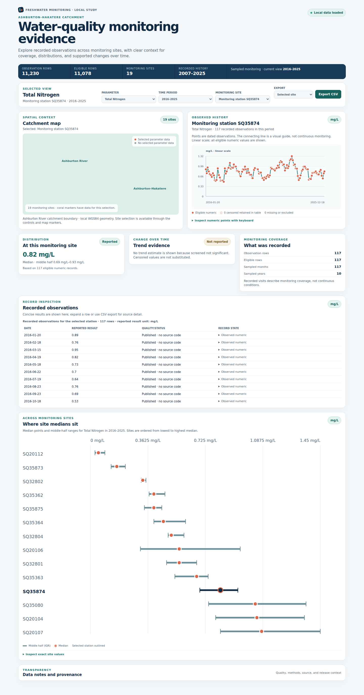

# Catchment Health Dashboard



This portfolio project presents a restrained, evidence-led view of freshwater
monitoring in the Ashburton–Hakatere catchment. It is designed like a small
consulting deliverable: show what was sampled, where, over which period, and
which summaries or neutral trend results are supported—without turning sparse
observations into a health score or compliance claim.

## What it does

- Coordinates a local MapLibre catchment map, station selection, parameter and
  time-window controls, observed history, distributions, comparison intervals,
  coverage, and an inspection table.
- Preserves original result text, units, timestamps, quality representation,
  censoring, exclusion reasons, source identifiers, and retrieval provenance.
- Uses six core parameters (E. coli, Nitrate-N Nitrite-N, Dissolved Reactive
  Phosphorus, Total Nitrogen, Turbidity, and Dissolved Oxygen), with Total
  Phosphorus and Water Temperature retained as secondary parameters.
- Exports the currently filtered records as UTF-8 CSV with attribution and
  provenance. Censored and excluded rows retain their meaning.

## Analytical and geospatial workflow

Public ECan/Hilltop responses are acquired at build time, checked against the
ECan Ashburton River major-catchment polygon, normalized into versioned Python
contracts, summarized, and materialized into a compact JSON shell with
parameter-partitioned observation detail. The browser does not call ECan during
visitor interactions. The latest reconciled build contains 11,230 source rows
from 19 exact station-ID matches; 15 stations return selected-parameter
observations and four are retained as observation-free or metadata-only scope.

The current retained history is 2007–2025, with 2016–2025 as the primary
window and 2020–2025 as the recent window. Medians and IQRs require at least
three eligible numeric observations and no eligible censored values. Trends
use the documented uncensored Theil–Sen/Kendall fallback with minimum data and
neutral `increasing`, `decreasing`, or `indeterminate` labels.

## Sources, licences, and limitations

Water Quality Data is reused under ECan's preserved dataset-specific CC BY 4.0
Terms of Use, with the required attribution and accompanying terms. The
surface-water monitoring sites and Major Catchment Boundaries carry separately
recorded CC BY 3.0 NZ licences. The exact terms evidence and hashes are in
[`docs/RELEASE_READINESS.md`](docs/RELEASE_READINESS.md) and `docs/release/`.

The reconciliation is complete against the identified source inventories, not
a claim of complete environmental monitoring. ECan publication delay,
irregular sampling, censored values, unavailable summaries, conservative trend
suppression, and the 120-day refresh/remove safeguard remain visible. No
regulatory threshold, causal explanation, composite score, ECan branding, or
live public deployment is included.

## Local setup

Prerequisites: Python 3.12+, Node.js 22+, npm, and a network connection to the
public ECan services for a fresh build.

From the repository root, the reproducible release rehearsal is:

```bash
python3 tools/release_build.py
```

That command acquires and validates public sources, reconciles station
inventories, generates ignored analytical/runtime assets, runs the public-mode
release gate, installs the locked frontend dependencies, and creates a static
production build plus an ignored release manifest. Use
`--skip-npm-install` when the lockfile installation is already present.

For a prepared local dashboard without a fresh acquisition:

```bash
cd web
npm ci
npm run dev
```

Open `http://localhost:5173/`. The UI must report “Local data loaded”; a
development sample warning means the ignored runtime asset was not prepared or
was blocked by freshness validation.

## Validation

```bash
python3 -m unittest discover -s tests -v
python3 tools/validate_fixture.py tests/fixtures/minimal_asset.json
python3 -m py_compile catchment_dashboard/*.py tools/*.py tests/*.py
cd web
npm run typecheck
npm run test:unit
npm run build
npm run test:browser
```

Browser verification uses local Chromium and checks real-data loading,
coordinated controls, MapLibre selection, accessibility, overflow, console and
network failures, export semantics, and representative responsive viewports.

## Release boundary

No public GitHub repository, live demo, or deployment is created by this
repository workflow. Before publication, run the release rehearsal from a
clean checkout, inspect the generated manifest and attribution/terms, confirm
the 120-day freshness/removal operation, and obtain owner authorization for
the external publication and deployment steps. Source code licensing and the
separately governed source/derived-data licences must not be conflated.
